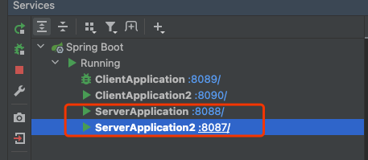
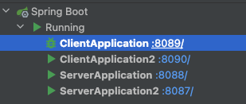
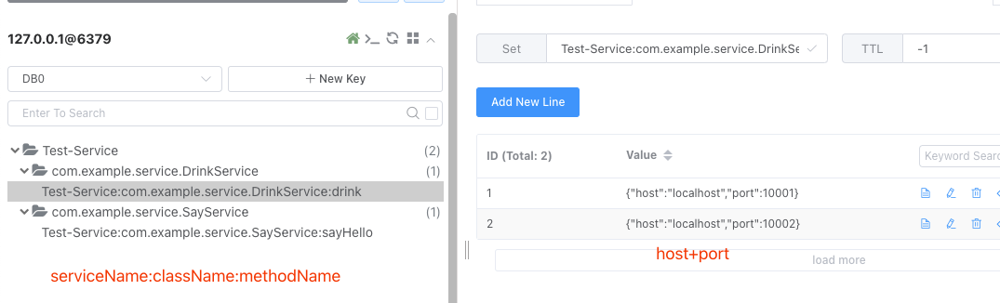
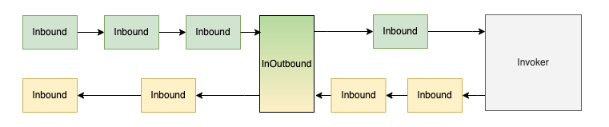

## 1、WRpc是什么

WRpc是一个RPC的MVP（Minimum Viable Product，最小可行产品）实现，**仅用作个人学习与交流，不用做实际生产！！！**

## 2、QuickStart

1. 参考wrpc-example模块

2. 下载项目，项目根目录执行`mvn clean install -U`，再通过IDEA services依次启动provider和consumer即可。

3. 先启动wrpc-provider，配置如下：

   -  ```yaml
      # redis作为默认注册中心
      spring:
        redis:
          host: localhost
          port: 6379
      
      ## wrpc 服务提供方 配置
      wrpc:
        service:
          name: Test-Service
        server:
      #    服务暴露地址
          host: localhost
          port: 10001
      
      logging:
        level:
          com.wentry: debug
          com.example: debug
      ```
      
   -  启动参数：`-Dserver.port=8088 -Dwrpc.server.port=10001 -Xmx128m -Xms128m`

   -  通过新增端口，同时开启多个provider：`-Dserver.port=8087 -Dwrpc.server.port=10002 -Xmx128m -Xms128m`

   -  

4. 再启动wrpc-consumer

   -  服务的发现是通过注册中心实现，因此consumer端的配置主要就是注册中心+接口声明

      -  ```yaml
         # redis作为默认注册中心
         spring:
           redis:
             host: localhost
             port: 6379
         
         ## wrpc 服务消费方 配置
         wrpc:
           service:
         #    指定消费的哪个服务，从注册中心去找
             name: Test-Service
           client:
             services: [
         #    消费哪些服务，再通过ProxyFactory获取实例
               "com.example.service.SayService",
               "com.example.service.DrinkService"
             ]
         
         server:
           port: 8089
         
         logging:
           level:
             com.wentry: debug
             com.example: debug
         ```
      
   -  也可以起多个consumer进行测试，`-Dserver.port=8090 -Xmx128m -Xms128m`和`-Dserver.port=8089 -Xmx128m -Xms128m`

   -  最终起了2个consumer+2个provider

   -  

5. 使用redis作为默认注册中心的实现，在provider启动之后，查看redis，能访问到provider节点信息：

   -  

6. 提供有基本优雅关闭的生命周期回调接口，在provider下线之后，会更新服务注册信息以及关闭channel

7. 最终的调用效果：

   -  


## 3、核心原理

借鉴于[Dubbo](https://cn.dubbo.apache.org/zh-cn/docsv2.7/dev/design/)的设计思想，抽象层如下：


以上为wrpc的抽象层结构，由最上的api一直到transport通信层，抽象了如下几个结构：

- **api**层：提供基本的接口定义，consumer和provider共同依赖，相当于代理层的物料来源

- **config**层：提供基本的配置抽象，有server端和client端之分，server主要用于配置host+port，client配置的是消费的接口，共有的配置就是注册中心+服务名

- **proxy**层：依据共同以来的api层的接口定义，进行jdk代理，关键的InvocationHandler类，封装了rpc的核心执行逻辑

- **registry**层：抽象了注册层面的接口，提供接口服务注册信息的增删改查，默认实现为redis，还可以扩展为Nacos，Zookeeper实现

- **directory**层：抽象了从注册中心拉取的服务信息，额外增加了路由+负载均衡的功能扩展。核心类为：

  - Directory：提供Invoker的增删（时机：服务的启停）、查（时机：请求的路由）
  - Cluster：多个相同服务的Invoker合成一个Cluster，Cluster.chooseInvoker方法可以扩展多种负载均衡算法（默认为RoundRobin轮训）
  - Invoker：连接directory和exchange层了，基本

- **filter**层：借鉴了Netty中Pipeline的设计，两个方向添加filter，最终构建成一个Pipeline

  - 

  - Consumer端配置注入容器即可完成Pipeline的装配：

  - ```java
    @Configuration
    public class ConsumerConfiguration {
    
        @Bean
        public Pipeline pipeline(){
            return new Pipeline()
                    .addLast(new MetricsOutBoundFilter())
                    .addLast(new LogInOutBoundFilter())
                    ;
        }
    }
    ```

  - Filter提供了扩展机制，可以定制化开发，如：日志打印、鉴权、metrics、限流、熔断等

  - 部分debug日志

    - ```bash
      11:17:42.196 [http-nio-8089-exec-1] INFO  c.e.c.filters.LogInOutBoundFilter - inbound req:{"className":"com.example.service.SayService","methodName":"sayHello","reqId":"ef3e3e43-12db-493d-968b-0050745bcb72"}
      11:17:42.196 [nioEventLoopGroup-2-1] DEBUG c.w.wrpc.transport.codec.PacketCodec - encode msg:{"rpcReq":{"className":"com.example.service.SayService","methodName":"sayHello","reqId":"ef3e3e43-12db-493d-968b-0050745bcb72"}}
      11:17:42.196 [nioEventLoopGroup-2-1] DEBUG c.w.w.exchange.impl.DefaultInvoker - req send complete:RpcReq{reqId='ef3e3e43-12db-493d-968b-0050745bcb72', className='com.example.service.SayService', methodName='sayHello', args=null}
      11:17:42.196 [nioEventLoopGroup-2-1] DEBUG c.w.wrpc.transport.codec.PacketCodec - decode msg:PooledUnsafeDirectByteBuf(ridx: 0, widx: 151, cap: 512)
      11:17:42.196 [nioEventLoopGroup-2-1] DEBUG c.w.w.transport.handler.RespHandler - RespHandler read msg :com.wentry.wrpc.transport.packet.RespPacket@57fdf576
      11:17:42.196 [http-nio-8089-exec-1] INFO  c.e.c.filters.LogInOutBoundFilter - outbound req:{"className":"com.example.service.SayService","methodName":"sayHello","reqId":"ef3e3e43-12db-493d-968b-0050745bcb72"}, resp:{"req":{"className":"com.example.service.SayService","methodName":"sayHello","reqId":"ef3e3e43-12db-493d-968b-0050745bcb72"},"res":"Hello world, i'm WRpc, a minimum viable Rpc implement. "}
      11:17:42.196 [http-nio-8089-exec-1] INFO  c.e.c.filters.MetricsOutBoundFilter - req:{"className":"com.example.service.SayService","methodName":"sayHello","reqId":"ef3e3e43-12db-493d-968b-0050745bcb72"},cost:560329ns, 0.56ms
      ```

- **exchange**层：接近通信的最后一层，核心对象为Invoker，持有channel连接，将请求转为ReqPacket发包，并阻塞当前线程，进行同步转异步

- **serilization**层：进行pojo对象和二进制流的互转，默认实现为Protobuff基础的Protostuff，也可以别的二进制流序列化框架如hessian

- **transport**层：底层使用的netty，通过netty的Handler进行业务处理

